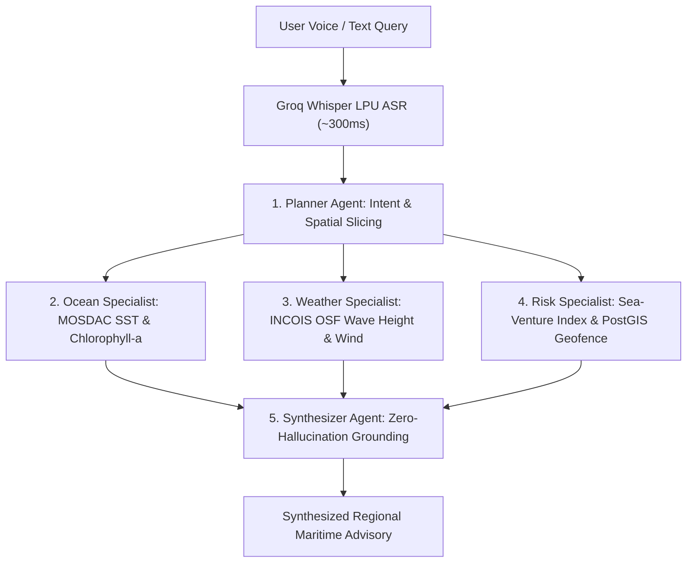

# 🐋 ORCA Multi-Agent Architecture (SIH26176)

ORCA (**Marine EcOsystem Reasoning with Collaborative Agents**) implements a 5-node collaborative Multi-Agent Directed Acyclic Graph (DAG) built using **LangGraph**, **Groq LPU**, **ISRO MOSDAC**, and **INCOIS ERDDAP** live telemetry feeds.

---

## 🏗️ Directed Acyclic Graph (DAG) Workflow

---

## 🤖 The 5 Agent Specialists

### 1. Planner Agent (`planner_agent.py`)
- **Intent Classification**: Decomposes user inquiries into domain intents: `pfz`, `weather`, `safety`, and `geofence`.
- **Entity & Port Geocoding**: Extracts coastal station anchors (e.g. Paradip Harbour, Haldia, Visakhapatnam, Chennai, Mumbai, Kochi) with geographic bounding boxes.
- **Multilingual Detection**: Supports English and Indic coastal languages (Hindi, Bengali, Tamil, Marathi).

### 2. Ocean Specialist Agent (`specialists.py` & `incois-service.ts`)
- **Telemetry Feeds**: Queries live INCOIS ERDDAP (`Indian_ARGO_Floats`) and ISRO MOSDAC (Oceansat-3 Ocean Color Monitor OCM-3 & Scatterometer).
- **Species HSI Engine**: Computes Gaussian-response Habitat Suitability Indices (0.0 to 1.0) for target commercial species (Indian Mackerel, Yellowfin Tuna, Hilsa/Sardines).
- **Thermal Gradient Analysis**: Detects coastal upwelling and optimal Potential Fishing Zone (PFZ) waypoints.

### 3. Weather Specialist Agent (`specialists.py` & `incois-service.ts`)
- **Telemetry Feeds**: Ingests INCOIS Ocean State Forecasts (OSF) and IMD coastal bulletins.
- **Metrics**: Significant Wave Height ($H_s$), Wave Period ($T$), Wind Velocity ($W$), Wind Direction, Squall / Lightning Probability ($L$), and Cyclone Alert Stage (Green, Yellow, Amber, Red).

### 4. Risk Specialist Agent (`specialists.py` & `incois-service.ts`)
- **Sea-Venture Hydrodynamic Safety Index**:
  $$\text{Safety Index} = 100 - (w_1 \cdot H_s + w_2 \cdot W + w_3 \cdot L) - \text{Penalty}_{\text{vessel}}$$
  Where weights ($w_1, w_2, w_3$) adapt dynamically to vessel displacement:
  - Artisanal Craft ($<8\text{m}$): $w_1 = 18.5, w_2 = 1.2, w_3 = 0.8$
  - Motorized Craft ($8-15\text{m}$): $w_1 = 12.0, w_2 = 0.9, w_3 = 0.7$
  - Deep-Sea Trawlers ($>15\text{m}$): $w_1 = 7.0, w_2 = 0.6, w_3 = 0.5$
- **PostGIS Geofence Guard**: Calculates distance in Nautical Miles to Marine Protected Areas (Gahirmatha Olive Ridley Turtle Sanctuary buffer $<12\,\text{NM}$) and the International Maritime Boundary Line (IMBL $<15\,\text{NM}$).

### 5. Synthesizer Agent (`synthesizer_agent.py` & Next.js API)
- **Anti-Hallucination Grounding**: Mathematically bounds synthesis strictly to numerical telemetry payloads from specialists.
- **Bilingual Formatter**: Delivers plain-language summaries followed by KaTeX formulas, Markdown tables, directional vectors, and source citations.
- **Execution Inspector**: Generates structured step traces displayed in the chat interface.

---

## 📡 Live Government Data Infrastructure

1. **INCOIS ERDDAP**:
   - Host: `https://erddap.incois.gov.in/erddap/`
   - Datasets: `Indian_ARGO_Floats`, `incois_oceansat2_datasets`, `incois_argo_sst_weekly`
   - Secure TLS connection with `{ rejectUnauthorized: false }` handling NIC intermediate certificates.
2. **ISRO MOSDAC**:
   - Host: `https://mosdac.gov.in`
   - Datasets: Oceansat-3 scatterometer wind vectors and OCM-3 Chlorophyll-a products.
3. **NASA GIBS Basemap**:
   - WMTS satellite base layer (`MODIS_Terra_CorrectedReflectance_TrueColor`) with OpenStreetMap (OSM) nautical fallback.
